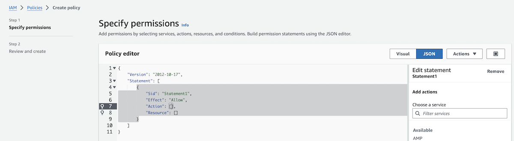
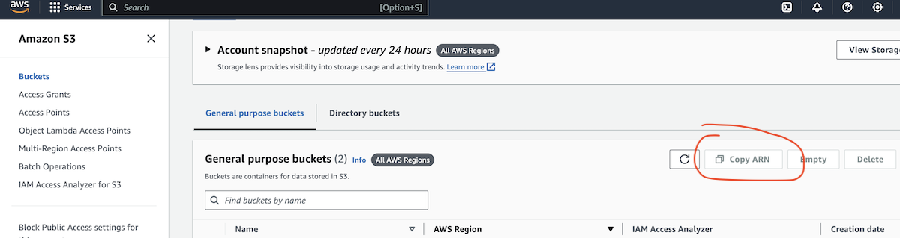

# Deployment

- The app was deployed to [Heroku](https://heroku.com/).
- The database was deployed to the [Code Institute's](https://codeinstitute.net/) student dedicated cloud.
- MEDIA files were deployed to [AWS](https://aws.amazon.com/)

- The app can be reached by the [link](https://carols-whimsy-bba92a6158ba.herokuapp.com/).

## Payment Setup

1. Register a stripe account at https://dashboard.stripe.com/register.
2. Go to the developers' page.

3. Select API keys.

4. Copy the `public key` and `secret key` to the `env.py` file.

5. Add the following setting to `settings.py`:

```python
  STRIPE_PUBLIC_KEY = os.getenv("STRIPE_PUBLIC_KEY")
  STRIPE_SECRET_KEY = os.getenv("STRIPE_SECRET_KEY")
```

6. Install stripe package:

```python
  pip3 install stripe
```

7. Create an order model with the required fields in the orders app.
8. Set up a payment app.
9. Add a payment form to the payment app template.
10. Add div to hold stripe element:

```html
  <div id="stripe-element"></div>
```
11. Create a View to handle payment setup:
  - Get public key: `stripe_public_key = settings.STRIPE_PUBLIC_KEY`
  - Get private key: `stripe_secret_key = settings.STRIPE_SECRET_KEY`
  - create intent: `intent = stripe.PaymentIntent.create(**kwargs)`
  - **kwargs for the payment intent should include:
    * `amount`: amount
    * `currency`: currency

  - Create context for the view with the following data:
      *  'client_secret': intent.client_secret,
      *  'stripe_public_key': stripe_public_key,
      *  _whatever else you would need for your template_

12. Add extra js block to payment template where you have to add csrf_token, stripe_public_key, script tag with stripe.js, and script tag with stripe-elements.js.


13. In the stripe-elements.js, create variables for stripe public key, stripe, payment element, payment form, and a variable from which you will receive 'client_secret.' To get 'client secret,` I have added data-attribute to confirmation button in the payment form:

```html
  data-secret="{{ client_secret }}"
```
14. Set up stripe element:

```javascript
    const elements = stripe.elements({ clientSecret, appearance });
    const paymentElement = elements.create('payment', options);
    paymentElement.mount('#payment-element');
```

*You can use various styling by checking out the following docs [stripe/elements-examples](https://github.com/stripe/elements-examples)*

15. For the rest of logic refer to my github files or readme.

16. To test the user's payment, you need to create a test payment intent with the test cards provided by the stripe

17. Create a success page to redirect the user after successful payment and add js functionality to handle the redirection.

18. Connect to [Webhooks](https://docs.stripe.com/webhooks). For local environment and development stage you will need to use [stripe CLI](https://docs.stripe.com/stripe-cli/overview). For deployment stage eventually the endpoint url of type 'https' must be connected.  
Note. Stripe issues webhook secret that must be provided to the backend. Stripe CLI issues a temporary webhook secret and it is different from that of standard provided by Stripe for 'https' endpoints.

19. Webhook handler must be created to manage order creation and saving as well as e-mail confirmations. Refer to my 'checkout' application.

__Note.__ These instructions set your Stripe account in the test mode. 
For production and real payments you will need to 'Complete profile' by running a compliance procedure from the top bar of your Stripe dashboard.

## Local deployment

Create a local copy of the GitHub repository:

1. Open a folder on your computer with the terminal.
2. Run the following command
  - `gh repo clone Mykola-CI/carols-whimsy`

---

3. Install the dependencies:

    - Open the terminal window and type: `pip3 install -r requirements.txt`


4. Create a `.gitignore` file in the root directory of the project where you should add env.py and __pycache__ files to prevent the privacy of your secret data.

5. Create an `.env` file. This will contain the following environment variables:

| Variable | What it does | Comments |
| ---- | ---- | ---- |
| SECRET_KEY= | sets unique identifier for the django project | |
| DEBUG = True | Server runs in DEBUG mode | on production server this variable must be added and set explicitly to False |
| DEVELOPMENT = True | Triggers local EmailBackend that exercises all emails via server's console | in production this variable must be set to False |
| EMAIL_HOST_USER= | django-allauth settings | required for email verification, sender's email |
| EMAIL_HOST_PASSWORD= | this is GMAIL app password API | if you use another mailing service refer to their API setting guide |
| DEFAULT_FROM_EMAIL= | django-allauth settings to show sender information | 


6. Run the following commands in a terminal to make migrations: 
    - `python3 manage.py makemigrations`
    - `python3 manage.py migrate`
7. Create a superuser to get access to the admin environment.
    - `python3 manage.py createsuperuser`
    - Enter the required information (your username, email and password).
8. Run the app with the following command in the terminal:
    - `python3 manage.py runserver`
9. Open the link provided in a browser to see the app.

10. If you need to access the admin page:
    - Add /admin/ to the link provided.
    - Enter your username and password (for the superuser that you have created before).
    - You will be redirected to the admin page.

## Create Database on ElephantSQL (alternatively you can choose any other provider)

__Important announcement:__ ElephantSQL will discontinue its services. The product will reach its End of Life on January 27, 2025. 

1. Go to [ElephantSQL](https://www.elephantsql.com/) and create a new account.

2. Create a new instance of the database.

3. Select a name for your database and select the free plan.

4. Click "Select Region"

5. Select a region close to you.

6. Click "Review"

7. Click "Create Instance"

8. Click on the name of your database to open the dashboard.

9. You will see the dashboard of your database. You will need the URL of your database to connect it to your Django project.

---

## Create Media Library on AWS

### AWS Account Setup
1. Sign Up for AWS
  - Go to the [AWS homepage](https://aws.amazon.com/) and click on "Create an AWS account".
  - Enter your email address, choose a password.
  - Verify your email address. 
  - Provide your account details including your name and contact information.
  - Enter your payment information. This is necessary even if you plan to use free-tier services
  - Verify Your Identity via Phone. Enter the provided PIN code during the call
  - Choose a support plan and complete the sign-up process.\
Once you receive a confirmation email, your account is ready for use. It may take up to 24 hours for full activation.

2. Create IAM User(s):\
After setting up your account, create IAM users with specific permissions for daily tasks.\
This reduces security risks associated with using the root user frequently
  - Navigate to the IAM service and create a new user with programmatic access.
  - Attach the "AmazonS3FullAccess" policy to this user.
  - Save the Access Key ID and Secret Access Key securely

### Amazon S3 Setup

1. Create an S3 Bucket
- In the AWS Management Console, navigate to the S3 service.
- Click on "Create bucket" and enter a unique name for your bucket. Choose a region close to your users.
- In configuration options __Object Ownership__ setting needs to be set with the __ACLs enabled__ and __Bucket owner preferred__ options checked.
- Configure Cross-origin resource sharing (CORS) section
  - go to __Permissions__ tab
  - scroll down to CORS and paste the following:
~~~
  [
    {
        "AllowedHeaders": [
            "Authorization"
        ],
        "AllowedMethods": [
            "GET"
        ],
        "AllowedOrigins": [
            "*"
        ],
        "ExposeHeaders": []
    }
  ]
~~~

2. IAM settings & Bucket Policy
- go <ins>services</ins> and select __Identity and Access Management (IAM)__.
- in Access management section select __User groups__ and create a group.
- then got to __Policies__ and click [create policy].
- select JSON tab

- click [Actions] dropdown and select [Import policy]
- import AmazonS3FullAccess policy 
- go to your buckets (S3 services) in a new Browser tab or new Window
- select the bucket you created and copy your Bucket ARN 

- return to your JSON policy and paste it to the "Resource" key:

~~~
{
    "Version": "2012-10-17",
    "Statement": [
        {
            "Sid": "PublicReadForMediaFolder",
            "Effect": "Allow",
            "Principal": "*",
            "Action": "s3:GetObject",
            "Resource": "arn:aws:s3:::YourBucketName/*"
        }
    ]
}
~~~

- Now click [next] to add tags (optional) and then go to the __Review Policy__ page.
- Give it a name and description and click [Create policy]
- Attach the policy to the group  
  - go to the group created earlier and click [Attach policy], 
  - search the policy by the name, select it
  - click [Attach policy]  
- Create a User
  - in IAM left pane menu in Access management section select [Users]
  - click [Create user] and give User a name, check Access type : __Programmatic access__ and select [Next]
  - check the Group created earlier with the policy attached
  - click [Create User]
- Retrieve access keys 
  - Go to IAM and select 'Users'
  - Select the user you've just created.
  - Select the 'Security Credentials' tab
  - Scroll to 'Access Keys' and click 'Create access key'
  - Select 'Application running outside AWS', and click next
  - On the next screen, you can leave the 'Description tag value' blank. Click 'Create Access Key'
  - Click the 'Download .csv file' button

### Connect AWS bucket to Django

- Update setting.py
~~~
if 'USE_AWS' in os.environ:
    # Cache control
    AWS_S3_OBJECT_PARAMETERS = {
        'Expires': 'Thu, 31 Dec 2099 20:00:00 GMT',
        'CacheControl': 'max-age=94608000',
    }

    # Bucket Config
    AWS_STORAGE_BUCKET_NAME = 'your-bucket-name'
    AWS_S3_REGION_NAME = 'your region as it was named in AWS'
    AWS_ACCESS_KEY_ID = os.environ.get('AWS_ACCESS_KEY_ID')
    AWS_SECRET_ACCESS_KEY = os.environ.get('AWS_SECRET_ACCESS_KEY')
    AWS_S3_CUSTOM_DOMAIN = f'{AWS_STORAGE_BUCKET_NAME}.s3.amazonaws.com'

    # Static and media files
    STATICFILES_STORAGE = 'custom_storages.StaticStorage'
    STATICFILES_LOCATION = 'static'
    DEFAULT_FILE_STORAGE = 'custom_storages.MediaStorage'
    MEDIAFILES_LOCATION = 'media'

    # Override static and media URLs in production
    STATIC_URL = f'https://{AWS_S3_CUSTOM_DOMAIN}/{STATICFILES_LOCATION}/'
    MEDIA_URL = f'https://{AWS_S3_CUSTOM_DOMAIN}/{MEDIAFILES_LOCATION}/'
~~~
- if you would like to test your AWS media setting from your local environment set in your `.env` file:\
USE_AWS = True


## Heroku Deployment

* Set up a local workspace on your computer for Heroku:
    - Create a list of requirements that the project needs to run:
      - type this in the terminal: `pip3 freeze > requirements.txt`
    - Commit and push the changes to GitHub
    
* Go to [www.heroku.com](https://www.heroku.com) 
* Log in or create a Heroku account.
* Create a new app with any unique name <name app>.

* Create a Procfile in your local workplace:
    
    This file will will contain the following:
    ```python
        web: gunicorn <name app>.wsgi:application
    ```
    - Commit and push the changes to GitHub.

* Go to resources in Heroku and search for postgresql. Select Hobby dev - Free and click on the provision button to add it to the project.

* Go to the settings app in Heroku and go to Config Vars.


Click on Reveal Config Vars and add the following config variables:

| Key      | Value          | Note |
| --------- | --------- | -------- |
| AWS_ACCESS_KEY_ID | ... | if you use AWS for media files hosting |
| AWS_SECRET_ACCESS_KEY | ... | if you use AWS for media files hosting |
| DATABASE_URL |... | Use your API key for the database |
| DEVELOPMENT | False | This will run your emails via your external host |
| EMAIL_HOST_PASS | ... | your email credentials |
| EMAIL_HOST_USER | ... | your email |
| DEFAULT_FROM_EMAIL | ... | default email according to allauth recommended settings |
| SECRET_KEY | ... | this is django secret key|
| DEBUG | False | this is required |
| STRIPE_PUBLIC_KEY | ... | Stripe API
| STRIPE_SECRET_KEY | ... | Stripe API
| STRIPE_WH_SECRET | ... | Stripe API


* Migrate changes.
* Commit and push the changes to GitHub.
* Connect your repository to Heroku in Deployment tab of your Heroku project page.
* Deploy the app to Heroku by clicking "Deploy Branch" button. If you want to enable auto-deployment, click "Enable Automatic Deployment".


---