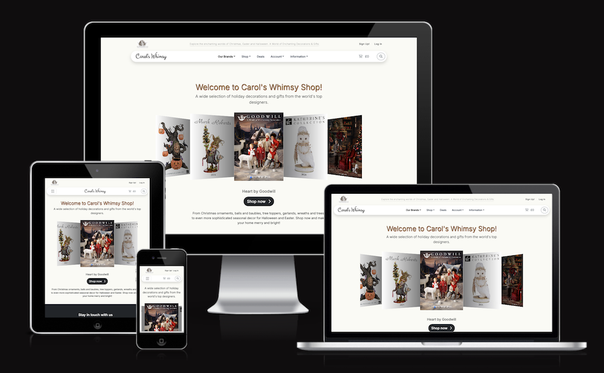
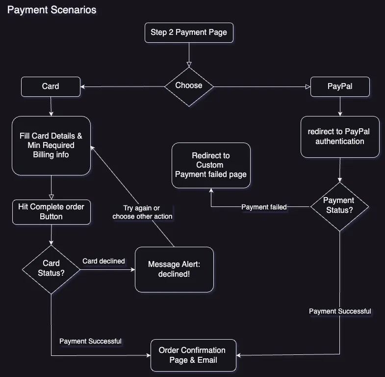

# Carol's Whimsy
Carol's Whimsy Online Boutique can be accessed 
[here](https://carols-whimsy-bba92a6158ba.herokuapp.com/) (test mode).

## E-commerce Business Model for Carol's Whimsy

### Overview
Carol's Whimsy intends to become an online B2C (Business-to-Consumer) platform specializing in the resale of festive decoration goods and gifts, sourced from the B2B provider [Goodwill, Belgium](https://goodwill.be/en/home-eng/). 

The platform focuses on seasonal decorations for Christmas, Easter, and Halloween, targeting the UK market. The business model is designed to leverage the convenience of online shopping to reach a broad audience, offering a diverse range of products such as ornaments, figures, home decor, dolls, flowers, branches, trees, wreaths, balls, and baubles etc.

### Choosing Brand Name
The draft Brand Name or trademark was chosen by its versatility as to Christmas and Easter whereas the word "whimsy" adds a playful and enchanting feel, suitable for a boutique offering unique and festive decorations. The team conducted the trademark search and at the moment the search gives negative result to the favor of the chosen name:

The relevant domains have also been secured:

### Purpose and Core Business Intents
- **Direct-to-Consumer Sales:**

The primary purpose of Carol's Whimsy is to sell decorative goods directly to consumers through an online platform. This approach allows for a direct relationship with the end-user, facilitating personalized marketing and customer engagement strategies.

- **Seasonal Product Offering:** 

By focusing on festive decorations, Carol's Whimsy can capitalize on seasonal demand spikes, ensuring a steady flow of customers during peak holiday seasons.

- **Wide Product Range:**

Offering a comprehensive range of decorative items ensures that customers can find everything they need for their festive decoration needs in one place, enhancing customer satisfaction and increasing the likelihood of repeat purchases.

### Marketing Strategies
- **Search Engine Optimization (SEO):** 

Implementing robust SEO strategies will enhance online visibility, driving organic traffic to the website. This includes optimizing product descriptions, using relevant keywords, and ensuring the website is mobile-friendly.

I conducted the search for keywords using google search prompts and [Moz keyword explorer](https://moz.com/explorer).\
<ins>Relevant topics identified in the order of priority:</ins>\
1. Christmas Ornaments & gifts
2. Easter Decorations
3. Halloween Gifts
4. Seasonal Home Decor

<ins>Keyword ideas found and shortlisted.</ins>\
short-tail:  Christmas decorations, Christmas tree decorations, homebase Christmas decorations, Christmas sale, Christmas ornaments, Christmas baubles, Christmas trees, Christmas home decorations, luxury Christmas decorations, Christmas decor, Easter eggs, Easter gifts, Easter decorations, halloween gifts\
long-tail: Easter egg decorating kits, handmade Christmas tree ornaments, unique Halloween gift ideas, affordable seasonal home decor for holidays 

The keywords are implanted into meta tags as well as scattered around the app, most of them on the landing page and About Us pages 

MOZ Keyword search for Christmas related topics:

MOZ Keyword search for Easter related topics:

- **Social Media Marketing:** 

Utilizing platforms like Instagram and Facebook to showcase products and engage with customers. Social media campaigns can highlight new arrivals, seasonal collections, and special promotions.

The relevant pages are created on Facebook and Instagram for Carol's Whimsy:\
[Carol's Whimsy FB page](https://www.facebook.com/profile.php?id=61565541958488)\
[Carol's Whimsy Instagram page](https://www.instagram.com/carolswhimsy.deco/?hl=en)

The FB screenshot archive: [here](documentation/marketing/fbcarols-mobile.pdf)

Youtube, X and Telegram remain unattended at the moment.

- **Email Marketing:** 

Building an email list to send targeted promotions, newsletters, and personalized recommendations to customers. This strategy helps in maintaining customer engagement and encouraging repeat purchases.

I set up a subscription form at the footer with large eye-catching title and I signed up for MailChimp services. 

 

- **Customer Loyalty Programs:** 

Introducing loyalty programs to reward repeat customers with discounts or exclusive access to new products. This can increase customer retention and lifetime value.

The platform is now ready for distribution of newsletter with new deals, bundle offers, promo codes and the likes. A registered customer can acquire and apply promo codes right away and get discount on the cart totals:

### Implications for the E-commerce Platform
- **User Experience:** 

The platform is designed using Django, JavaScript, JQuery, and Bootstrap 5 to ensure a seamless and responsive user experience across devices. This is crucial for maintaining customer satisfaction and reducing cart abandonment rates.

- **Scalability:** 

The e-commerce platform must be scalable to handle increased traffic during peak seasons. This involves optimizing server resources and ensuring robust backend support.

- **Data Analytics:** 

Implementing analytics tools to track customer behavior, sales trends, and marketing campaign effectiveness. This data will inform business decisions and marketing strategies, helping to optimize operations and improve customer targeting.

- **Security and Payment Processing:** 

Ensuring secure transactions through reliable payment gateways and adhering to data protection regulations to build customer trust.

## Disclaimer

- **Initial Project Phase:** This project represents the foundational stage of a future business venture. It serves as a prototype for the envisioned commercial platform, providing a basis for further development and refinement.
- **Incomplete Feature Set:** Given the constraints of time, the project is not yet fully realized. While it includes essential features to initiate commercial operations, there are numerous enhancements required to reach a fully operational and comprehensive platform. It is designed to evolve and expand over time.
- **Priority Future Developments:** Key features that need to be prioritized in future iterations include:
  - <ins>Customer ratings and reviews</ins> to enhance user engagement and trust.
  - <ins>Advanced filtering options</ins> and faceted navigation to improve product discoverability.
  - <ins>Stock availability control</ins> to mark out-of-stock items and ensure customer is alerted on delivery terms.
  - <ins>Efficient customer contact handling</ins> to facilitate communication and support.

- **Non-Realistic Pricing:**\
The prices displayed in Carol's catalog are placeholders and do not reflect actual market values.
- **Non-Realistic Star Rating:**\
The star ratings as well as a number of votes displayed in the Carol's catalog and the Product Detail view are placeholders and do not reflect actual ratings. For now they are for the front end demonstration only and must be implemented as a functionality in future. 
- **Payment in Test Mode**\
Meaning it is fictitious. Payments are made in simulation mode arranged by Stripe for testing. Using Stripe test card numbers. Here some of them can be tried:

| Card Type | Card Number | Action |
| ---- | ---- | ---- | 
| Valid card | 5555 5582 6555 4449 | payment successful |
| Generic decline	            | 4000 0000 0000 0002 |	card_declined |
| Insufficient funds decline	| 4000 0000 0000 9995	| card_declined	| 

- **Fictitious Contact Information:**\
The contact details provided for the shop are fictional and intended solely for demonstration purposes.
- **Generic Informational Pages:**\
The "About Us" and "FAQ" pages contain generic content and will require detailed, specific information in future updates to accurately represent the business and address customer inquiries.

## User Stories

User stories as a guidance for the project can be found on my GitHub [here](https://github.com/Mykola-CI/carols-whimsy/issues).\
__Note__: To see all issues the `is:open` filter must be removed or follow [this link](https://github.com/Mykola-CI/carols-whimsy/issues?q=is%3Aissue+sort%3Acreated-asc).

The stories had been tracked using the [Kanban board](https://github.com/users/Mykola-CI/projects/6/views/1) and some other table views utilized during development, such as MoSCoW (prioritizing), Themes (functionality grouping), Epic-to-Stories (epic-to-story dependencies) and Roles (grouped by User roles) tables. 

In total there are 59 GitHub issues including 6 epics that evolved into stories. As a summary:
- Total User Stories = 53 including
  - Total in "Done" category = 44
  - Total remaining in "Backlog" category = 9 - to be worked on and finished as the project develops into a production stage. 

## Application Overview & Features

### [All Users] flows

#### Top bar & Navigation Bar

__FEATURES INCLUDE__:

- top bar:  
  - Goodwill logo clickable to the external parent site
  - Slogan: visible on tablets and desktops
  - Sign Up! and Log in links
- Navigation bar:
  - Carol's Whimsy logo clickable to the home page
  - Main menu with self-explaining titles
  - Shopping cart icon with total cart amount - clickable to open cart summary for the quick review

 

- Navigation bar:
  - Search icon: toggles the search input

#### Footer

__FEATURES INCLUDE__:

- Side menus to simplify UX making navigation easier
- Subscribe titles and input 
- Social links  

#### Home Page Swiper

__FEATURES INCLUDE__:

- Mouse or Touch sensitive swiper to shift pictures of product categories
- Titles change dynamically to match pictures as captions
- Call to action 'shop now' button to open the Catalog page with the filter applied in line with the selected picture/caption

#### SignUp page

- Features Account benefits Banner for larger screens 

#### Catalog features

- Number of products filtered
- [Clear all] button to clear filters and get all products grid
- [Sort by..] select to sort prices in both orders
- Breadcrumb element with clickable Home link
- Product cards with [Add to cart] button - call to action

#### Product detail features
<ins>Added to Product info</ins>:
- Description promo text
- Size
- Color
- Material

- Add to cart button
- Quantity setting buttons:......  

#### Shopping cart features

- Free delivery threshold declaration
- Progress bar to indicate amount left to the free shipping
- Cart line items table
- Quantity controls
- Remove item [ X ] button
- [ Clear Cart ] button
- Order summary side panel
- [ Proceed to checkout ] Call to action
- [ Create an account ]  Call to action
- [ Apply promo code ] Call to action\
(the latter can be seen by all users and can physically be applied by all users, however promo codes are supplied only with news letters and to the registered users)
- [ continue shopping ] call to action

- tooltips how to remove items - on hover.\
(if the quantity is 1, the tooltip on top of [-] button prompts to click [x] button to remove the item)

 

#### Checkout Step 1 - shipping form

After [Proceed to checkout] action User gets to the Step 1 checkout.\
The form must be filled by Anonymous User.

#### Checkout Step 2 - Payment form

After [Continue] action User gets to the Step 2 checkout.\
A Customer can either choose payment options:
1. card
2. PayPal\
or:
3. review Shipping Address
4. continue shopping
5. return to the cart to make amends by clicking the cart icon in navbar

#### Checkout - Payment scenarios

___________________

### [Registered Users] flows.

#### Login

#### Top Bar changes to

<ins>Top Bar for registered users features:</ins>
- Link to Wishlist appears
- Logout link appears
- The named greeting appears

#### 

