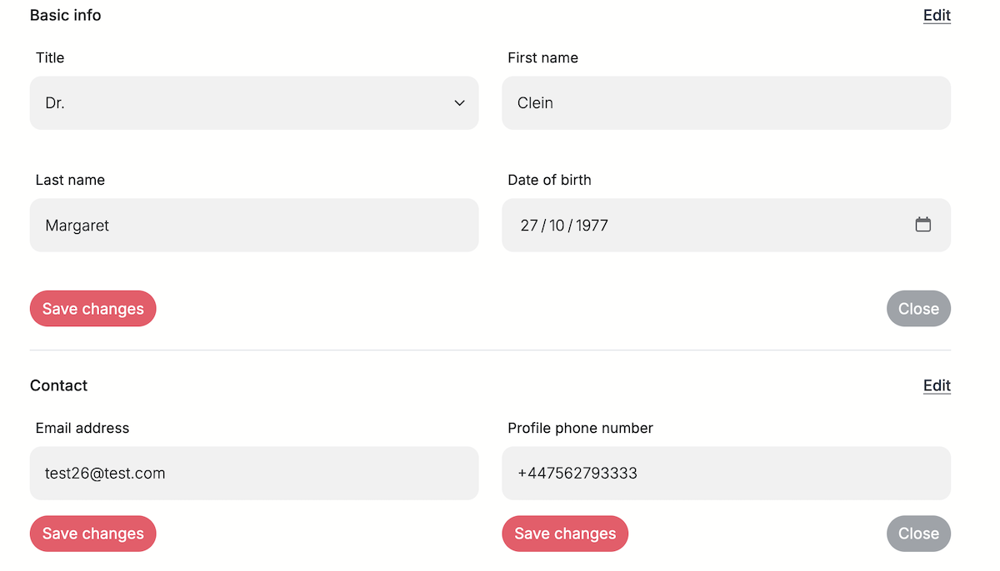
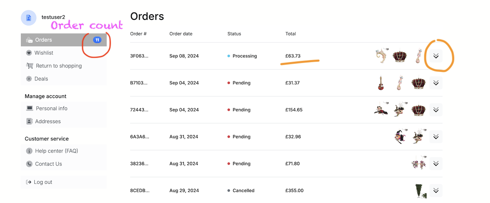

# Carol's Whimsy
Carol's Whimsy Online Boutique can be accessed 
[here](https://carols-whimsy-bba92a6158ba.herokuapp.com/) (test mode).

## E-commerce Business Model for Carol's Whimsy

### Overview
Carol's Whimsy intends to become an online B2C (Business-to-Consumer) platform specializing in the resale of festive decoration goods and gifts, sourced from the B2B provider [Goodwill, Belgium](https://goodwill.be/en/home-eng/). 

The platform focuses on seasonal decorations for Christmas, Easter, and Halloween, targeting the UK market. The business model is designed to leverage the convenience of online shopping to reach a broad audience, offering a diverse range of products such as ornaments, figures, home decor, dolls, flowers, branches, trees, wreaths, balls, and baubles etc.

### Choosing Brand Name
The draft Brand Name or trademark was chosen by its versatility as to Christmas and Easter whereas the word "whimsy" adds a playful and enchanting feel, suitable for a boutique offering unique and festive decorations. The team conducted the trademark search and at the moment the search gives negative result to the favor of the chosen name:

The relevant domains have also been secured:

### Purpose and Core Business Intents
- **Direct-to-Consumer Sales:**

The primary purpose of Carol's Whimsy is to sell decorative goods directly to consumers through an online platform. This approach allows for a direct relationship with the end-user, facilitating personalized marketing and customer engagement strategies.

- **Seasonal Product Offering:** 

By focusing on festive decorations, Carol's Whimsy can capitalize on seasonal demand spikes, ensuring a steady flow of customers during peak holiday seasons.

- **Wide Product Range:**

Offering a comprehensive range of decorative items ensures that customers can find everything they need for their festive decoration needs in one place, enhancing customer satisfaction and increasing the likelihood of repeat purchases.

### Marketing Strategies
- **Search Engine Optimization (SEO):** 

Implementing robust SEO strategies will enhance online visibility, driving organic traffic to the website. This includes optimizing product descriptions, using relevant keywords, and ensuring the website is mobile-friendly.

I conducted the search for keywords using google search prompts and [Moz keyword explorer](https://moz.com/explorer).\
<ins>Relevant topics identified in the order of priority:</ins>\
1. Christmas Ornaments & gifts
2. Easter Decorations
3. Halloween Gifts
4. Seasonal Home Decor

<ins>Keyword ideas found and shortlisted.</ins>\
short-tail:  Christmas decorations, Christmas tree decorations, homebase Christmas decorations, Christmas sale, Christmas ornaments, Christmas baubles, Christmas trees, Christmas home decorations, luxury Christmas decorations, Christmas decor, Easter eggs, Easter gifts, Easter decorations, halloween gifts\
long-tail: Easter egg decorating kits, handmade Christmas tree ornaments, unique Halloween gift ideas, affordable seasonal home decor for holidays 

The keywords are implanted into meta tags as well as scattered around the app, most of them on the landing page and About Us pages 

MOZ Keyword search for Christmas related topics:

MOZ Keyword search for Easter related topics:

- **Social Media Marketing:** 

Utilizing platforms like Instagram and Facebook to showcase products and engage with customers. Social media campaigns can highlight new arrivals, seasonal collections, and special promotions.

The relevant pages are created on Facebook and Instagram for Carol's Whimsy:\
[Carol's Whimsy FB page](https://www.facebook.com/profile.php?id=61565541958488)\
[Carol's Whimsy Instagram page](https://www.instagram.com/carolswhimsy.deco/?hl=en)

The FB screenshot archive: [here](documentation/marketing/fbcarols-mobile.pdf)

Youtube, X and Telegram remain unattended at the moment.

- **Email Marketing:** 

Building an email list to send targeted promotions, newsletters, and personalized recommendations to customers. This strategy helps in maintaining customer engagement and encouraging repeat purchases.

I set up a subscription form at the footer with large eye-catching title and I signed up for MailChimp services. 

 

- **Customer Loyalty Programs:** 

Introducing loyalty programs to reward repeat customers with discounts or exclusive access to new products. This can increase customer retention and lifetime value.

The platform is now ready for distribution of newsletter with new deals, bundle offers, promo codes and the likes. A registered customer can acquire and apply promo codes right away and get discount on the cart totals:

### Implications for the E-commerce Platform
- **User Experience:** 

The platform is designed using Django, JavaScript, JQuery, and Bootstrap 5 to ensure a seamless and responsive user experience across devices. This is crucial for maintaining customer satisfaction and reducing cart abandonment rates.

- **Scalability:** 

The e-commerce platform must be scalable to handle increased traffic during peak seasons. This involves optimizing server resources and ensuring robust backend support.

- **Data Analytics:** 

Implementing analytics tools to track customer behavior, sales trends, and marketing campaign effectiveness. This data will inform business decisions and marketing strategies, helping to optimize operations and improve customer targeting.

- **Security and Payment Processing:** 

Ensuring secure transactions through reliable payment gateways and adhering to data protection regulations to build customer trust.

## Disclaimer

- **Initial Project Phase:** This project represents the foundational stage of a future business venture. It serves as a prototype for the envisioned commercial platform, providing a basis for further development and refinement.
- **Incomplete Feature Set:** Given the constraints of time, the project is not yet fully realized. While it includes essential features to initiate commercial operations, there are numerous enhancements required to reach a fully operational and comprehensive platform. It is designed to evolve and expand over time.
- **Priority Future Developments:** Key features that need to be prioritized in future iterations include:
  - <ins>Customer ratings and reviews</ins> to enhance user engagement and trust.
  - <ins>Advanced filtering options</ins> and faceted navigation to improve product discoverability.
  - <ins>Stock availability control</ins> to mark out-of-stock items and ensure customer is alerted on delivery terms.
  - <ins>Efficient customer contact handling</ins> to facilitate communication and support.

- **Non-Realistic Pricing:**\
The prices displayed in Carol's catalog are placeholders and do not reflect actual market values.
- **Non-Realistic Star Rating:**\
The star ratings as well as a number of votes displayed in the Carol's catalog and the Product Detail view are placeholders and do not reflect actual ratings. For now they are for the front end demonstration only and must be implemented as a functionality in future. 
- **Payment in Test Mode**\
Meaning it is fictitious. Payments are made in simulation mode arranged by Stripe for testing. Using Stripe test card numbers. Here some of them can be tried:

| Card Type | Card Number | Action |
| ---- | ---- | ---- | 
| Valid card | 5555 5582 6555 4449 | payment successful |
| Generic decline	            | 4000 0000 0000 0002 |	card_declined |
| Insufficient funds decline	| 4000 0000 0000 9995	| card_declined	| 

- **Fictitious Contact Information:**\
The contact details provided for the shop are fictional and intended solely for demonstration purposes.
- **Generic Informational Pages:**\
The "About Us" and "FAQ" pages contain generic content and will require detailed, specific information in future updates to accurately represent the business and address customer inquiries.

## User Stories

User stories as a guidance for the project can be found on my GitHub [here](https://github.com/Mykola-CI/carols-whimsy/issues).\
__Note__: To see all issues the `is:open` filter must be removed or follow [this link](https://github.com/Mykola-CI/carols-whimsy/issues?q=is%3Aissue+sort%3Acreated-asc).

The stories had been tracked using the [Kanban board](https://github.com/users/Mykola-CI/projects/6/views/1) and some other table views utilized during development, such as MoSCoW (prioritizing), Themes (functionality grouping), Epic-to-Stories (epic-to-story dependencies) and Roles (grouped by User roles) tables. 

In total there are 59 GitHub issues including 6 epics that evolved into stories. As a summary:
- Total User Stories = 53 including
  - Total in "Done" category = 44
  - Total remaining in "Backlog" category = 9 - to be worked on and finished as the project develops into a production stage. 

## Application Overview & Features

### Features for [All Users]

#### Top bar & Navigation Bar

__FEATURES INCLUDE__:

- top bar:  
  - Goodwill logo clickable to the external parent site
  - Slogan: visible on tablets and desktops
  - Sign Up! and Log in links
- Navigation bar:
  - Carol's Whimsy logo clickable to the home page
  - Main menu with self-explaining titles
  - Shopping cart icon with total cart amount - clickable to open cart summary for the quick review

 

- Navigation bar:
  - Search icon: toggles the search input

#### Footer

__FEATURES INCLUDE__:

- Side menus to simplify UX making navigation easier
- Subscribe titles and input 
- Social links  

#### Home Page Swiper

__FEATURES INCLUDE__:

- Mouse or Touch sensitive swiper to shift pictures of product categories
- Titles change dynamically to match pictures as captions
- Call to action 'shop now' button to open the Catalog page with the filter applied in line with the selected picture/caption

#### SignUp page

- Features Account benefits Banner for larger screens 

#### Catalog features

- Number of products filtered
- [Clear all] button to clear filters and get all products grid
- [Sort by..] select to sort prices in both orders
- Breadcrumb element with clickable Home link
- Product cards with [Add to cart] button - call to action

#### Product detail features
<ins>Added to Product info</ins>:
- Description promo text
- Size
- Color
- Material

- Add to cart button
- Quantity setting buttons:......  

#### Shopping cart features

- Free delivery threshold declaration
- Progress bar to indicate amount left to the free shipping
- Cart line items table
- Quantity controls
- Remove item [ X ] button
- [ Clear Cart ] button
- Order summary side panel
- [ Proceed to checkout ] Call to action
- [ Create an account ]  Call to action
- [ Apply promo code ] Call to action\
(the latter can be seen by all users and can physically be applied by all users, however promo codes are supplied only with news letters and to the registered users)
- [ continue shopping ] call to action

- tooltips how to remove items - on hover.\
(if the quantity is 1, the tooltip on top of [-] button prompts to click [x] button to remove the item)

 

#### Checkout Step 1 - shipping form

After [Proceed to checkout] action User gets to the Step 1 checkout.\
The form must be filled by Anonymous User.

#### Checkout Step 2 - Payment form

After [Continue] action User gets to the Step 2 checkout.\
A Customer can either choose payment options:
1. card
2. PayPal\
or:
3. review Shipping Address
4. continue shopping
5. return to the cart to make amends by clicking the cart icon in navbar

#### Checkout - Payment scenarios

___________________

### Features for [Registered Users].

#### Login

#### Top Bar changes to

<ins>Top Bar for registered users features:</ins>
- Link to Wishlist appears
- Logout link appears
- The named greeting appears

#### Account menus

Become accessible to Registered Users.\
When Anonymous user hits one of the menus such user gets redirected to the Login page with Account Benefits pane.

- Left Side Navigation Pane - enhances UX making navigation easier and isolates Account pages in a stand-alone privileged module.

- <ins>Personal Info page features:</ins>
  - __Basic info managing__.\
  Click [Edit] to make changes and toggle the Bootstrap 'collapse' element.\
  Make changes and submit the form
  - __Contact__.\
  There are 2 forms here; e-mail and phone. The reason for dividing this section in 2 forms is that email requires verification, and the phone does not.

- ... continue personal info page features
  - __Password__ change
  - __Delete Account__\
  Hitting delete shows modal with the explanation text what can happen next.

__DISCLAIMER.__\
The modal warns a customer that the profile will be deactivated immediately but it will be kept in records up to 14 days.\
THIS FUNCTIONALITY HAS NOT BEEN REALISED YET AND AT THE MOMENT ACCOUNT IS PERMANENTLY DELETED.\
The User Story is included to the project, but not done within this timeframe, [refer to the User Story](https://github.com/Mykola-CI/carols-whimsy/issues/67)

- <ins>Shipping addresses</ins>

_The Features worth mentioning:_\
   -The button [Edit] initiates the modal form for shipping address to edit\
   -Inside the form User can find the checkbox 'Set as default shipping address'\
   -The page has a link to add one more address to the list

- <ins>Order History</ins> 

_This Account Page Features:_\
-Table of historical orders, each order being displayed as row\
-Table columns depict Order num., Order Date, Status (pending, delivered etc), Order total\
-Each order line is decorated with small thumbnails of product photos from the order\
-Order line items can be quickly looked at by toggling the collapse element button down or up.\
-Registered customer can look up particular order confirmation details by hitting the order number link  

- <ins>Wishlist</ins> 

Registered and authenticated User can add product to the wishlist vie Product detail view.\
Only authenticated users can see the secret button

 

_The Wishlist view features:_\
-add to cart button\
-checkboxes inside each product card to select or unselect item\
-one master checkbox to select all or unselect all\
-and remove selected button and icon 

#### Checkout Features for Registered Customers

- <ins>Shipping Details Form pre-fill</ins>
- <ins>Save changes or new details as a new shipping address</ins>

__NOTE.__ Only registered and authenticated users can see the checkbox "Save to your profile"

### Features for [Shop Personnel]

Technically "Shop Personnel" are those users who are given the "staff" status by the superuser.

For the Shop personnel users teh Account menus reveal the chapter "Management Pages".\

#### Dashboard

All Management pages feature the left navigation pane similar to User Account pages:\

The dashboard gives quantitative overview of the entire product portfolio actively on sale via the platform.

#### Add product

Hitting + Add Product on the left navigation pane opens up the product form

#### Edit or Remove Product 

Hitting Edit Product on the left navigation pane redirects the shop personnel user to the catalog view

There the user can either open the pre-filled form for the existing product or just remove it from the database.\
The Edit form features the small thumbnail of the photo currently uploaded for that product.

Cancelling the operation redirects the shop personnel user to the Dashboard page.

#### Orders LookUp

The order number is a clickable link to the historical order confirmation similar to the Registered User flows.\
However, there is one distinction though.\
Under order confirmation line items:
- Anonymous User can see 'Continue shopping' link
- Authenticated User can see 'Return to Order History' link 
- Shop personnel user can see 'Return to Shop Orders' link

## Data Modeling

Apart from all built-in django models or those of 3d party vendors like django-allauth I have to deploy 12 custom models to provide for the current levels of the application functionality.  

### Brand, Category, Theme, Season

Technically these models are almost identical in structure and serve as quasi-categories altogether

| Name          | Field Type    | Validation |
| ------------- | ------------- | ---------- |
| name          | CharField | max_length=255, unique=True |
| friendly_name | CharField | max_length=254, null=True, blank=True |
| description | TextField | blank=True, null=True |

However, this kind of categorization is required by business model and the nature of merchandise to market.

### Product

| Name          | Field Type    | Validation |
| ------------- | ------------- | ---------- |
| name          | CharField | max_length=255 |
| sku | CharField | max_length=100, unique=True, blank=False |
| brand | ForeignKey | on_delete=models.CASCADE, default=1, related_name='branded_products' |
| category | ForeignKey | on_delete=models.CASCADE, default=1, related_name='group_of_products' |
| theme | ForeignKey | on_delete=models.CASCADE, default=1, related_name='theme_products' |
| season | ForeignKey | on_delete=models.CASCADE, default=1, related_name='season_products' |
| price | DecimalField | max_digits=6, decimal_places=2 |
| promo_text | TextField | blank=True, null=True |
| size | CharField | max_length=255, blank=True, null=True |
| material | CharField | blank=True, null=True |
| color | CharField | max_length=255, blank=True, null=True |
| other_details | TextField | blank=True, null=True |
| discount | DecimalField | max_digits=3, decimal_places=2, default=0, validators=[MinValueValidator(0), MaxValueValidator(1)] |
| image | ImageField | upload_to='', blank=True, null=True |
| image_url | URLField | max_length=1024, blank=True, null=True |

__NOTES__.\
The discount field must be commented. It is the Decimal type of value with minimum and maximum limits : from 0 to 1.\
The backend logic treats it as a decimal discount ratio. For example, discount = 0.1 means 10% discount and the price after discount must be calculated:\
price = old_price * (1 - 0.1)

### Order

| Name          | Field Type    | Validation |
| ------------- | ------------- | ---------- |
| order_number | CharField | max_length=32, null=False, editable=False |
| user_profile | ForeignKey | UserProfile, on_delete=models.SET_NULL, null=True, blank=True, related_name='orders' |
| first_name | CharField | max_length=40, null=False, blank=False |
| last_name | CharField | max_length=40, null=False, blank=False |
| email | EmailField | max_length=254, null=False, blank=False |
| phone_number | CharField | max_length=20, null=False, blank=False |
| country | CharField |  blank_label='Select country', null=False, blank=False |
| postcode | CharField | max_length=20, null=True, blank=True |
| town_city | CharField | max_length=40, null=False, blank=False |
| street_address | CharField | max_length=254, null=False, blank=False |
| county | CharField | max_length=80, null=True, blank=True |
| date | DateTimeField | auto_now_add=True |
| delivery_cost | DecimalField |  max_digits=6, decimal_places=2, null=False, default=0 |
| saving | DecimalField | max_digits=10, decimal_places=2, null=False, default=0 |
| order_total | DecimalField | max_digits=10, decimal_places=2, null=False, default=0 |
| grand_total | DecimalField |  max_digits=10, decimal_places=2, null=False, default=0 |
| original_cart | TextField | null=False, blank=False, default='' |
| stripe_pid | CharField |  max_length=254, unique=True, null=False, blank=False, default='' |
| status | CharField |  max_length=20, choices=STATUS_CHOICES, null=False, blank=False, default='Pending' |

__NOTES__.
1. Status. It is defined by the choices:
~~~
STATUS_CHOICES = [
        ('Pending', 'Pending'),
        ('Processing', 'Processing'),
        ('Shipped', 'Shipped'),
        ('Delivered', 'Delivered'),
        ('Cancelled', 'Cancelled'),
    ]
~~~
2. Saving. This field stores the discount information derived from the promo code application.

### OrderLineItem

| Name          | Field Type    | Validation |
| ------------- | ------------- | ---------- |
| order | ForeignKey |  Order, null=False, blank=False, on_delete=models.CASCADE, related_name='lineitems' |
| product | ForeignKey | Product, null=False, blank=False, on_delete=models.CASCADE |
| quantity | IntegerField | null=False, blank=False, default=0 |
| item_total | DecimalField | max_digits=6, decimal_places=2, null=False, blank=False, editable=False |

### UserProfile

| Name          | Field Type    | Validation |
| ------------- | ------------- | ---------- |
| user | OneToOneField | User, on_delete=models.CASCADE |
| profile_phone_number | CharField | max_length=20, null=True, blank=True |
| profile_street_address | CharField | max_length=255, null=True, blank=True |
| profile_town_city | CharField | max_length=40, null=True, blank=True |
| profile_county | CharField | max_length=80, null=True, blank=True |
| profile_postcode | CharField | max_length=20, null=True, blank=True |
| profile_country | CountryField | blank_label='Country', null=True, blank=True |
| profile_date_of_birth | DateField | null=True, blank=True | 
| profile_title | CharField | max_length=5, choices=TITLE_CHOICES, blank=True, null=True |

__NOTES__.\
Django Signal is used to create or update user profile whenever a new instance of User is created and/or updated.

### ShippingAddress

| Name          | Field Type    | Validation |
| ------------- | ------------- | ---------- |
| user_profile | ForeignKey | UserProfile, related_name='addresses', on_delete=models.CASCADE |
| delivery_first_name | CharField | max_length=50 |
| delivery_last_name | CharField  | max_length=50 | 
| delivery_phone_number | CharField  | max_length=20 | 
| delivery_email | EmailField  | max_length=254 | 
| shipping_street_address | CharField  | max_length=255 | 
| shipping_town_city | CharField  | max_length=40 | 
| shipping_county | CharField  | max_length=80 | 
| shipping_postcode | CharField  | max_length=20 | 
| shipping_country | CountryField  | blank_label='Country' | 
| shipping_is_default | BooleanField  | default=False | 

__NOTES__.
1. shipping_is_default: this name is self-explaining as it is to put a "default" tag on the address
2. The model has an intricate custom save method to ensure that if at least one address exists there is always a default and it is the only one.
~~~
def save(self, *args, **kwargs):
        """ Override save method to set default shipping address
        to ensure there is only one default address per user"""

        if (
            not self.pk
                and ShippingAddress.objects.filter(
                    user_profile=self.user_profile).count() == 0):
            self.shipping_is_default = True
        elif self.shipping_is_default:
            # Set all other addresses for this user to non-default
            ShippingAddress.objects.filter(
                user_profile=self.user_profile, shipping_is_default=True
            ).update(shipping_is_default=False)
        super().save(*args, **kwargs)
~~~ 

### Wishlist

| Name          | Field Type    | Validation |
| ------------- | ------------- | ---------- |
| user | OneToOneField | User, on_delete=models.CASCADE |
| products | ManyToManyField | Product, blank=True |

__NOTES__. There is not much to say about this one. A user selects a product and saves it until further action is taken.

### CommercialConstant

This model allows the owner to set different values, such as, delivery percentage, delivery threshold, promocode key value pairs, even taxes or other rates if needed.

| Name          | Field Type    | Validation |
| ------------- | ------------- | ---------- |
| name | CharField | max_length=50, unique=True |
| friendly_name | CharField | max_length=150, blank=True, null=True |
| value | CharField | max_length=255 |
| constant_type | CharField | max_length=5, choices=CONSTANT_TYPES |
| description | TextField | blank=True, null=True |

__NOTES__.
1. The choices for the constant types are:
CONSTANT_TYPES = [
        ('int', 'Integer'),
        ('str', 'String'),
        ('float', 'Float'),
    ]
2. The value derived from the field is defined by the `get_value` method:
~~~
 def get_value(self):
        if self.constant_type == 'int':
            return int(self.value)
        elif self.constant_type == 'float':
            return float(self.value) / 100
        return self.value
~~~

### PromoCodeUsage

This model is used for tracking promo code usage by users to prevent from misuse and to track the usage statistics.

| Name          | Field Type    | Validation |
| ------------- | ------------- | ---------- |
| user | ForeignKey | User, on_delete=models.CASCADE |
| promo_code | CharField | max_length=50 |
| used_at | DateTimeField | auto_now_add=True |

## Flowcharts on Major Logic

