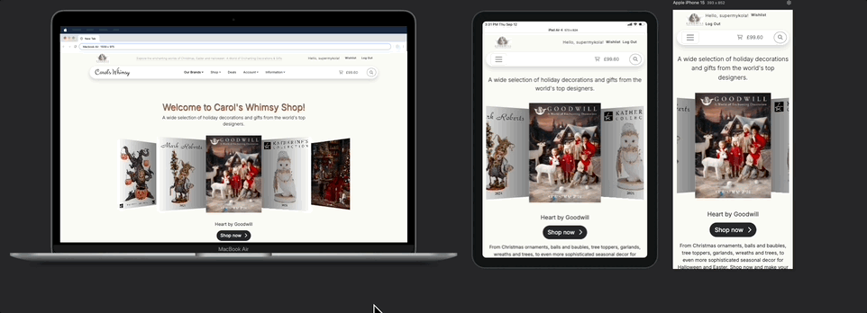
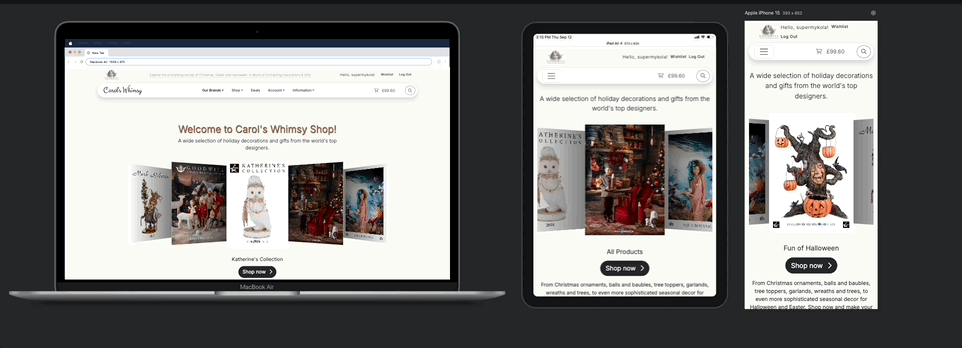
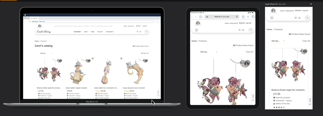
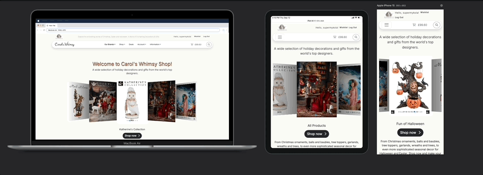

# TESTING
## Validation

### HTML validation

No errors found in my html. This checking was done manually by copying the view page source code and pasting it into the validator.
There are warnings though, all of them being "The type attribute is unnecessary for JavaScript resources" for all cases of script implanted into templates.

The reports can be found here:
- [About Page](documentation/validation/html-validator-about.png)
- [Vendor pages: add_product](documentation/validation/html-validator-add-product.png)
- [Catalog](documentation/validation/html-validator-catalog.png)
- [Contact Us](documentation/validation/html-validator-contacts.png)
- [Vendor pages: edit product](documentation/validation/html-validator-edit-product.png)
- [FAQ page](documentation/validation/html-validator-faq.png)
- [Home](documentation/validation/html-validator-home.png)
- [User Account pages: Orders](documentation/validation/html-validator-order-history.png)
- [User Account pages: Personal Info](documentation/validation/html-validator-personal_info.png)
- [Product Detail](documentation/validation/html-validator-product-detail.png)
- [User Account: shipping addresses](documentation/validation/html-validator-shipping-addr.png)
- [Vendor pages: dashboard](documentation/validation/html-validator-vendor-dashboard.png)
- [Vendor pages: orders](documentation/validation/html-validator-vendor-orders.png)
- [User Account pages: wishlist](documentation/validation/html-validator-wishlist.png)

### CSS Validation

- [CSS validation report: base.css](documentation/validation/css-valid-base.png)
  - body Property `font-optical-sizing` doesn't exist : `auto`

  The font-optical-sizing CSS property does exist: 
   
   [Web Reference: font-optical-sizing](https://webreference.com/css/properties/font-optical-sizing/)

   [Mdn web docs: font-optical-sizing](https://developer.mozilla.org/en-US/docs/Web/CSS/font-optical-sizing)

  It is used to control whether text rendering is optimized for different sizes, improving legibility and aesthetics. 
  This property is particularly useful for fonts that have an optical size variation axis, which allows them to adjust the outlines of glyphs based on the font size and resolution. 
  This means that smaller text sizes may be rendered with thicker strokes for better contrast, while larger text sizes may appear more delicate with more contrast between strokes.\
  I use -__Inter__- as a font family which is a <ins>variable</ins> font and it does support the property.

    <ins>Values of font-optical-sizing</ins>\
    __auto:__ This is the default value and enables optical sizing. 
    It allows the browser to automatically adjust the font's design based on the size, optimizing it for legibility across different sizes.\
    __none:__ Disables optical sizing, meaning the font will not adjust its design based on size changes

- [CSS validation report: catalog.css](documentation/validation/css-valid-catalog.png)
- [CSS validation report: checkout.css](documentation/validation/css-valid-checkout.png)
- [CSS validation report: information.css](documentation/validation/css-valid-information.png.png)
- [CSS validation report: profile.css](documentation/validation/css-valid-profile.png)

__Explanation of the other Errors Revealed in Validator Results:__

All of the parse errors reported by W3C CSS validator are related to 'CSS nested rules', which the validator does not yet support, the 'nested CSS' syntax being a relatively new feature. 
The issue has been discussed in a number of places, particularly on GitHub issues , Reddit and some other less popular blogs.

It is acknowledged that such approach as CSS nesting reduces redundancy and simplifies the management of complex styles, leading to cleaner and more organized code. 
Additionally, CSS nesting aligns with the principles of modular design, which is especially in demand for complex and large-scale projects.
Moreover, CSS nesting is supported by all major modern browsers: 

| Browser Name: | Full support from: | Version released in: |
| ---- | ---- | ---- |
| Chrome | version 120 | released in 2023 |
| Edge | version 120 | released in 2023 |
| Firefox | version 117 | released in 2023 |
| Safari | version 17.2 | released in 2023 |
| Opera | version 106 | released in 2023 |
| Chrome for Android | version 125 | released in 2024 |
| Safari on iOS | version 17.2 | released in 2023 |
| Samsung Internet | version 25 | released in 2024 |
| Opera Mobile | version 80 | released in 2023 |
| Firefox for Android | version 126 | released in 2024 |

[Link to 'Can I Use' reg Nesting Selector](https://caniuse.com/mdn-css_selectors_nesting)

[Using CSS Nesting Selector MDN](https://developer.mozilla.org/en-US/docs/Web/CSS/CSS_nesting/Using_CSS_nesting)

### PEP 8
I used Flake8 package for checking the custom project folders for Python compliance in CLI.
- [Pep8: carols_home app CLI report](documentation/validation/flake8/flake-carols-home.png)

'F401 imported but unused': 

'django.contrib.admin' in admin.py \
'django.db.models' in models.py\
'django.test.TestCase' in tests.py

The above files are empty except standard imports pre-filled by django when starting application.\
I deliberately left them unscathed to utilize these files in further development.

- [Pep8: carols_project folder CLI report](documentation/validation/flake8/flake-carols-project.png)

E501 line too long found in my settings.py, particularly for the following:
~~~
AUTH_PASSWORD_VALIDATORS = [
    {
        'NAME': 'django.contrib.auth.password_validation.UserAttributeSimilarityValidator',
    },
    {
        'NAME': 'django.contrib.auth.password_validation.MinimumLengthValidator',
    },
    {
        'NAME': 'django.contrib.auth.password_validation.CommonPasswordValidator',
    },
    {
        'NAME': 'django.contrib.auth.password_validation.NumericPasswordValidator',
    },
]
~~~

I leave it as is because if I break it it will become quite less readable.

- [Pep8: cart app CLI report](documentation/validation/flake8/flake-cart.png)

'F401 imported but unused': 

'django.contrib.admin' in admin.py \
'django.db.models' in models.py\
'django.test.TestCase' in tests.py

The above files are empty except standard imports pre-filled by django when starting application.

F841 local variable '_' is assigned but unused in views.py is related to :
~~~
except Exception as _:
        messages.error(
            request, "There was an error adding the product to your cart.")
~~~
I replaced `e` with an underscore _, which is a conventional way to indicate that a variable is intentionally unused. In this context I could use it for debugging, but in any case I don't want to confuse user with sophisticated messages.

- [Pep8: information app CLI report](documentation/validation/flake8/flake-information.png)

Here we have the same three F401 'imported but unused' errors as these files are empty except automatically pre-populated imports in __admin.py__ , __models.py__ and __tests.py__.

- [Pep8: vendor app CLI report](documentation/validation/flake8/flake-root-vendor.png)

E501 errors 'line too long' are found only in migrations files.\
The same F401 'imported but unused' fount in the empty tests.py.

- [Pep8: checkout app CLI report](documentation/validation/flake8/flake-user-checkout.png)

F401 'checkout.signals' imported but unused:
~~~
from django.apps import AppConfig

class CheckoutConfig(AppConfig):
    default_auto_field = 'django.db.models.BigAutoField'
    name = 'checkout'

    def ready(self):
        import checkout.signals
~~~

It's common to import the signals module in the AppConfig.ready() method to ensure that signal handlers are connected when the application starts.

E501 'line too long' errors are found only in migrations, automatically generated by Django.

- [Pep8: products app CLI report](documentation/validation/flake8/flake-user-products.png)

E501 'line too long' errors are found only in migrations, automatically generated by Django.

- [Pep8: user_profile app CLI report](documentation/validation/flake8/flake-user-profile.png)

E501 'line too long' errors are found only in migrations, automatically generated by Django.

### JS Validation

The full JSHint report is [here](documentation/validation/jshint_report_carols_whimsy.pdf)

As a summary, I must state that no errors on the custom script, all 'undefined variables' warnings are caused by the vendors' scripts (like Bootstrap, Swiper or MailChimp) which define them in their external files with links placed earlier in the code.

## Responsiveness

Checked on real devices: Desktop, MacBook Pro, Ipad Mini, iPhone14 Pro, iPhoneSE, Samsung Galaxy M33
Checked in Chrome DevTools and FireFox Inspect mode.
Checked in Responsive Viewer extension for Chrome.

- Swiper home page

- Footer

- Catalog

- Cart offcanvas

