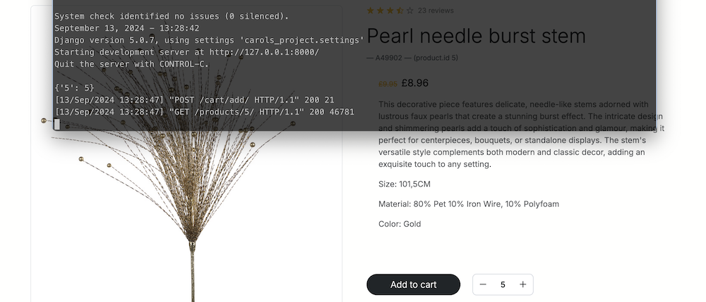
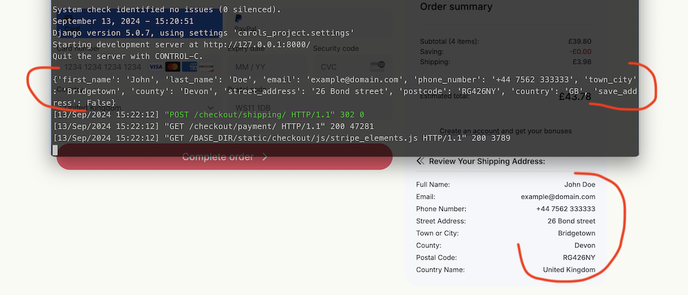
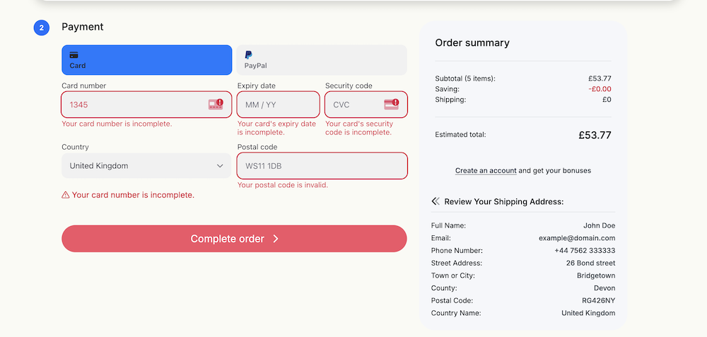
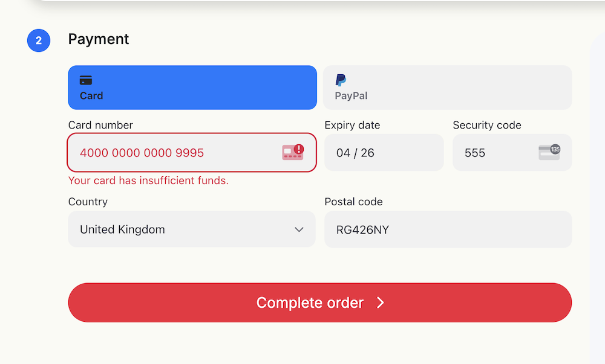
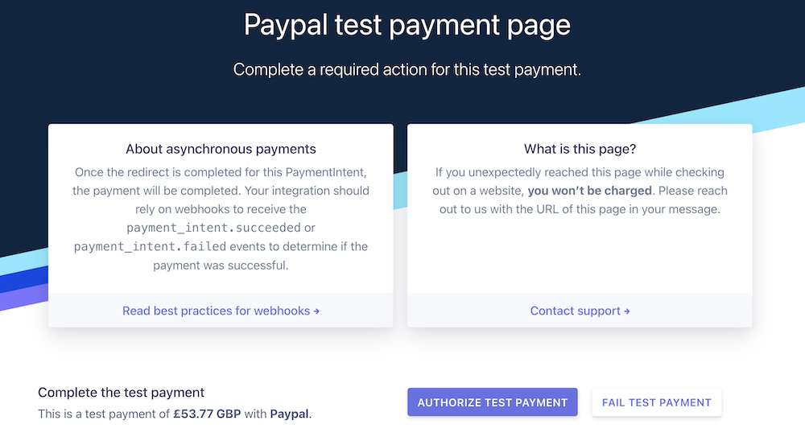
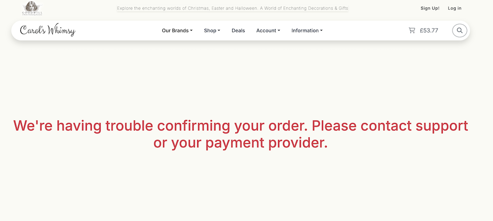
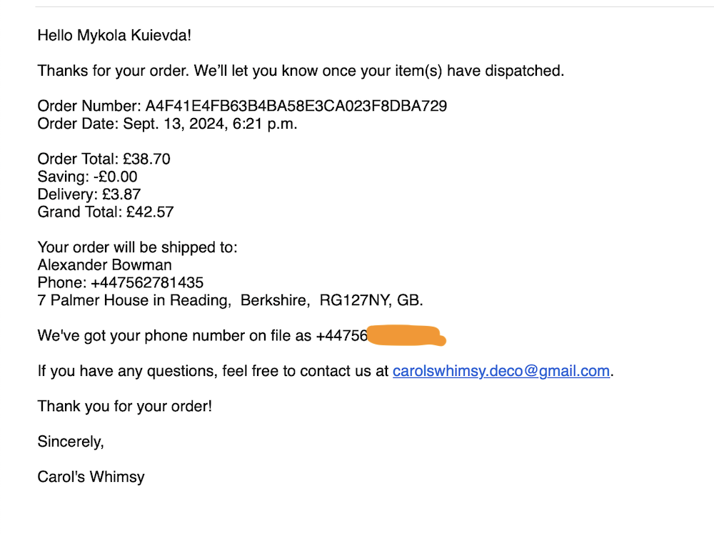
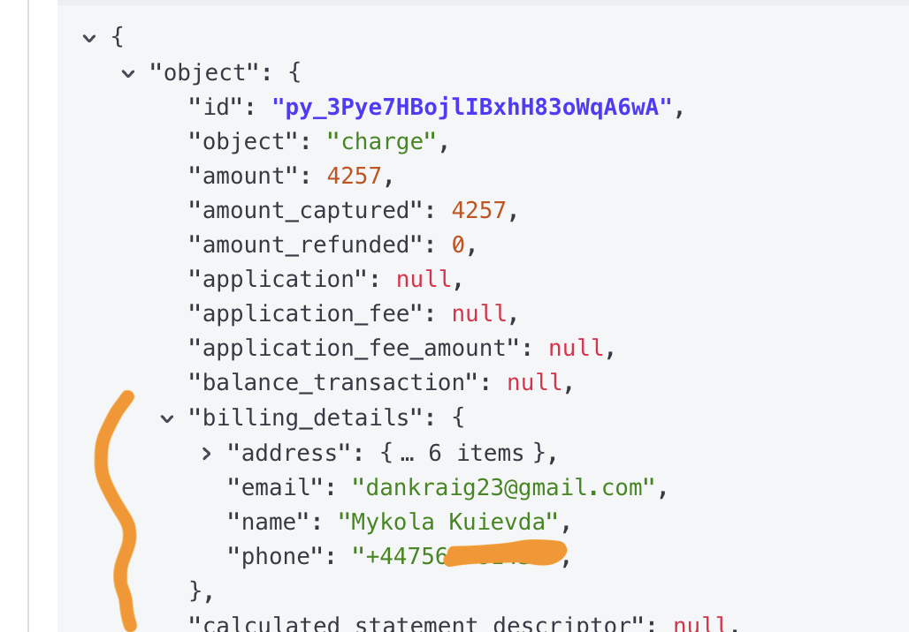
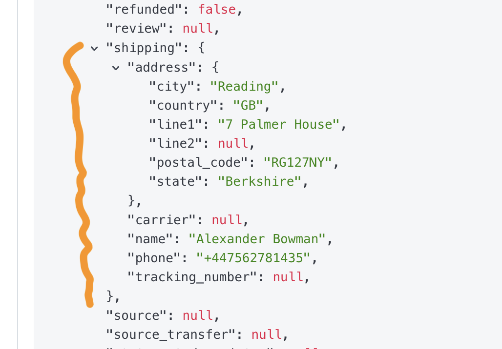
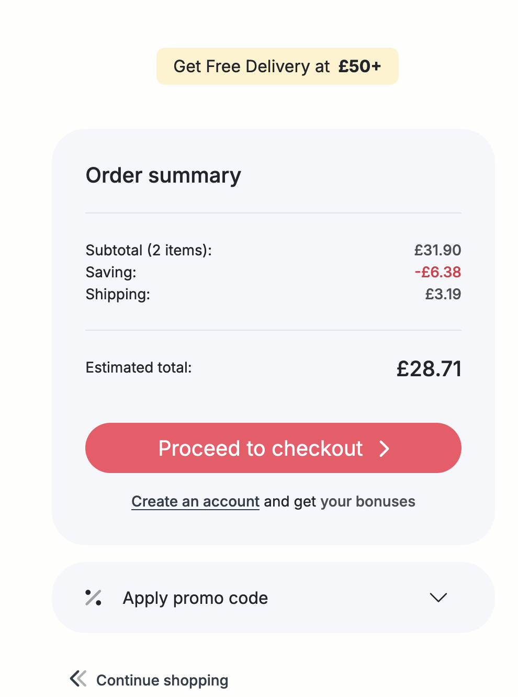

# TESTING
## Validation

### HTML validation

No errors found in my html. This checking was done manually by copying the view page source code and pasting it into the validator.
There are warnings though, all of them being "The type attribute is unnecessary for JavaScript resources" for all cases of script implanted into templates.

The reports can be found here:
- [About Page](documentation/validation/html-validator-about.png)
- [Vendor pages: add_product](documentation/validation/html-validator-add-product.png)
- [Catalog](documentation/validation/html-validator-catalog.png)
- [Contact Us](documentation/validation/html-validator-contacts.png)
- [Vendor pages: edit product](documentation/validation/html-validator-edit-product.png)
- [FAQ page](documentation/validation/html-validator-faq.png)
- [Home](documentation/validation/html-validator-home.png)
- [User Account pages: Orders](documentation/validation/html-validator-order-history.png)
- [User Account pages: Personal Info](documentation/validation/html-validator-personal_info.png)
- [Product Detail](documentation/validation/html-validator-product-detail.png)
- [User Account: shipping addresses](documentation/validation/html-validator-shipping-addr.png)
- [Vendor pages: dashboard](documentation/validation/html-validator-vendor-dashboard.png)
- [Vendor pages: orders](documentation/validation/html-validator-vendor-orders.png)
- [User Account pages: wishlist](documentation/validation/html-validator-wishlist.png)

### CSS Validation

- [CSS validation report: base.css](documentation/validation/css-valid-base.png)
  - body Property `font-optical-sizing` doesn't exist : `auto`

  The font-optical-sizing CSS property does exist: 
   
   [Web Reference: font-optical-sizing](https://webreference.com/css/properties/font-optical-sizing/)

   [Mdn web docs: font-optical-sizing](https://developer.mozilla.org/en-US/docs/Web/CSS/font-optical-sizing)

  It is used to control whether text rendering is optimized for different sizes, improving legibility and aesthetics. 
  This property is particularly useful for fonts that have an optical size variation axis, which allows them to adjust the outlines of glyphs based on the font size and resolution. 
  This means that smaller text sizes may be rendered with thicker strokes for better contrast, while larger text sizes may appear more delicate with more contrast between strokes.\
  I use -__Inter__- as a font family which is a <ins>variable</ins> font and it does support the property.

    <ins>Values of font-optical-sizing</ins>\
    __auto:__ This is the default value and enables optical sizing. 
    It allows the browser to automatically adjust the font's design based on the size, optimizing it for legibility across different sizes.\
    __none:__ Disables optical sizing, meaning the font will not adjust its design based on size changes

- [CSS validation report: catalog.css](documentation/validation/css-valid-catalog.png)
- [CSS validation report: checkout.css](documentation/validation/css-valid-checkout.png)
- [CSS validation report: information.css](documentation/validation/css-valid-information.png.png)
- [CSS validation report: profile.css](documentation/validation/css-valid-profile.png)

__Explanation of the other Errors Revealed in Validator Results:__

All of the parse errors reported by W3C CSS validator are related to 'CSS nested rules', which the validator does not yet support, the 'nested CSS' syntax being a relatively new feature. 
The issue has been discussed in a number of places, particularly on GitHub issues , Reddit and some other less popular blogs.

It is acknowledged that such approach as CSS nesting reduces redundancy and simplifies the management of complex styles, leading to cleaner and more organized code. 
Additionally, CSS nesting aligns with the principles of modular design, which is especially in demand for complex and large-scale projects.
Moreover, CSS nesting is supported by all major modern browsers: 

| Browser Name: | Full support from: | Version released in: |
| ---- | ---- | ---- |
| Chrome | version 120 | released in 2023 |
| Edge | version 120 | released in 2023 |
| Firefox | version 117 | released in 2023 |
| Safari | version 17.2 | released in 2023 |
| Opera | version 106 | released in 2023 |
| Chrome for Android | version 125 | released in 2024 |
| Safari on iOS | version 17.2 | released in 2023 |
| Samsung Internet | version 25 | released in 2024 |
| Opera Mobile | version 80 | released in 2023 |
| Firefox for Android | version 126 | released in 2024 |

[Link to 'Can I Use' reg Nesting Selector](https://caniuse.com/mdn-css_selectors_nesting)

[Using CSS Nesting Selector MDN](https://developer.mozilla.org/en-US/docs/Web/CSS/CSS_nesting/Using_CSS_nesting)

### PEP 8
I used Flake8 package for checking the custom project folders for Python compliance in CLI.
- [Pep8: carols_home app CLI report](documentation/validation/flake8/flake-carols-home.png)

'F401 imported but unused': 

'django.contrib.admin' in admin.py \
'django.db.models' in models.py\
'django.test.TestCase' in tests.py

The above files are empty except standard imports pre-filled by django when starting application.\
I deliberately left them unscathed to utilize these files in further development.

- [Pep8: carols_project folder CLI report](documentation/validation/flake8/flake-carols-project.png)

E501 line too long found in my settings.py, particularly for the following:
~~~
AUTH_PASSWORD_VALIDATORS = [
    {
        'NAME': 'django.contrib.auth.password_validation.UserAttributeSimilarityValidator',
    },
    {
        'NAME': 'django.contrib.auth.password_validation.MinimumLengthValidator',
    },
    {
        'NAME': 'django.contrib.auth.password_validation.CommonPasswordValidator',
    },
    {
        'NAME': 'django.contrib.auth.password_validation.NumericPasswordValidator',
    },
]
~~~

I leave it as is because if I break it it will become quite less readable.

- [Pep8: cart app CLI report](documentation/validation/flake8/flake-cart.png)

'F401 imported but unused': 

'django.contrib.admin' in admin.py \
'django.db.models' in models.py\
'django.test.TestCase' in tests.py

The above files are empty except standard imports pre-filled by django when starting application.

F841 local variable '_' is assigned but unused in views.py is related to :
~~~
except Exception as _:
        messages.error(
            request, "There was an error adding the product to your cart.")
~~~
I replaced `e` with an underscore _, which is a conventional way to indicate that a variable is intentionally unused. In this context I could use it for debugging, but in any case I don't want to confuse user with sophisticated messages.

- [Pep8: information app CLI report](documentation/validation/flake8/flake-information.png)

Here we have the same three F401 'imported but unused' errors as these files are empty except automatically pre-populated imports in __admin.py__ , __models.py__ and __tests.py__.

- [Pep8: vendor app CLI report](documentation/validation/flake8/flake-root-vendor.png)

E501 errors 'line too long' are found only in migrations files.\
The same F401 'imported but unused' fount in the empty tests.py.

- [Pep8: checkout app CLI report](documentation/validation/flake8/flake-user-checkout.png)

F401 'checkout.signals' imported but unused:
~~~
from django.apps import AppConfig

class CheckoutConfig(AppConfig):
    default_auto_field = 'django.db.models.BigAutoField'
    name = 'checkout'

    def ready(self):
        import checkout.signals
~~~

It's common to import the signals module in the AppConfig.ready() method to ensure that signal handlers are connected when the application starts.

E501 'line too long' errors are found only in migrations, automatically generated by Django.

- [Pep8: products app CLI report](documentation/validation/flake8/flake-user-products.png)

E501 'line too long' errors are found only in migrations, automatically generated by Django.

- [Pep8: user_profile app CLI report](documentation/validation/flake8/flake-user-profile.png)

E501 'line too long' errors are found only in migrations, automatically generated by Django.

### JS Validation

The full JSHint report is [here](documentation/validation/jshint_report_carols_whimsy.pdf)

As a summary, I must state that no errors on the custom script, all 'undefined variables' warnings are caused by the vendors' scripts (like Bootstrap, Swiper or MailChimp) which define them in their external files with links placed earlier in the code.

## Responsiveness

Checked on real devices: Desktop, MacBook Pro, Ipad Mini, iPhone14 Pro, iPhoneSE, Samsung Galaxy M33.\
Checked in Chrome DevTools and FireFox Inspect mode.\
Checked in Responsive Viewer extension for Chrome.

- Swiper home page

Full GIF Report of Responsive Viewer is [here](documentation/responsive/responsive.md).

## Lighthouse

- Home Page 

Full screens report is [here](documentation/lighthouse/lighthouse.md).

## Manual Testing

### Segmented by User Story Themed Groups 
All references to User Stories are mapped using numbers as per my [GitHub Issues](https://github.com/Mykola-CI/carols-whimsy/issues?q=is%3Aissue+sort%3Acreated-asc) for the project. 

__NOTE!__: 
- To see all issues the filter `is:open` must be removed or follow [this link](https://github.com/Mykola-CI/carols-whimsy/issues?q=is%3Aissue+sort%3Acreated-asc)
- The protocol on manual testing refers only those User Stories that are not immediately obvious and worth testing from my perspective.

| num. | Test Name | Purpose | User Story | Findings
| ---- | ---- | ---- | ---- | ---- |
| | |__Product presentation__ | 
| 1 | Check Swiper links | Test all slides' captions and 'shop now' button for any wrong or broken links | [#1](https://github.com/Mykola-CI/carols-whimsy/issues/1), [#4](https://github.com/Mykola-CI/carols-whimsy/issues/4)  | 'Shop Now' leads to Catalog page, product cards are filtered in line with slide captions |
| 2 | Product search | Check if the words keyed in to the search bar trigger correct filters | [#3](https://github.com/Mykola-CI/carols-whimsy/issues/3) | Checked both words and numbers, both leading to correct results, total count of products found in place. Note: sometimes it is not obvious why such result, one needs to get to product detail view to see why |
| 3 | Product filters | Test all filters accessible from the Our Brands navigation bar menu | [#29](https://github.com/Mykola-CI/carols-whimsy/issues/29) | Checked 4 brands +1 All products from Our Brands menu. All filters work as expected, number of product found displayed correctly |
| 4 | Product filters | Test all filters accessible from the Shop navigation bar menu | [#29](https://github.com/Mykola-CI/carols-whimsy/issues/29) | Tested 9 product categories, 16 themes, 4 seasons from Shop menu. All filters work as expected, number of product found displayed correctly |
| 5 | Sorting | Test price sorting ascending order | [#34](https://github.com/Mykola-CI/carols-whimsy/issues/34) | Tested sorting by selecting 'prices from low to high' from the select menu. Sorting implemented as expected. The 'low to high' selected option is displayed inside the select element |
| 6 | Sorting | Test price sorting descending order | [#34](https://github.com/Mykola-CI/carols-whimsy/issues/34) | Tested sorting by selecting 'prices from high to low' from the select menu. Sorting implemented as expected. The 'high to low' selected option is displayed inside the select element |
| 7 | Sorting after Filter | Test price sorting after applying a filter | [#34](https://github.com/Mykola-CI/carols-whimsy/issues/34) | Tested sorting after applying filters one-by-one. Sorting implemented within the filtered set only and correct. No conflicts found |
| 8 | Link to Product detail view | Check for broken or wrong links to product detail view | [#2](https://github.com/Mykola-CI/carols-whimsy/issues/2) | the Links tested. All is good |
| | | | | 
| | | __Shopping Cart features__ |
| 9 | Add to cart | Test add to cart button on the Product Detail view | [#6](https://github.com/Mykola-CI/carols-whimsy/issues/6) | The button adds product to the cart. Manifestations: Amount shown beside the cart icon increases, offcanvas cart shows the added product and quantity, Shopping cart view shows the product is there, the session object (a dictionary) logged and checked. Success message pops up temporarily in the toast style |
| 10 | Add to cart | Test adding to cart item "Pearl needle burst stem" quantity=2, repeat the same item quantity=1 from Product Detail view | [#6](https://github.com/Mykola-CI/carols-whimsy/issues/6) | The product item added to the cart first time (the log from session {"5": 2}), if the same item added second or multiple times, the new line in the cart is not added - only quantity of previously added item increases {"5": 3}. Tested for different products |
| 11 | Add to cart | Test add to cart button from Catalog view | [#6](https://github.com/Mykola-CI/carols-whimsy/issues/6) | The button adds product to the cart with the quantity = 1. |
| 12 | Cart saved to session | Test if the cart dictionary exists in the session if cart is not empty | [#6](https://github.com/Mykola-CI/carols-whimsy/issues/6) | After adding products to the cart the cart appears in the session. Tested multiple times and logged out the result to CLI: ex. {"5": 3, "8": 2, "47": 4}  |
| 13 | Offcanvas Cart element | Test shopping cart button toggle offcanvas cart | [#37](https://github.com/Mykola-CI/carols-whimsy/issues/37) | the button shows offcanvas cart summary. Cart contents with quantities and cart totals are shown and correct |

- Item id=5 quantity=5 added to cart and saved to the user session

| num. | Test Name | Purpose | User Story | Findings
| ---- | ---- | ---- | ---- | ---- |
| | |__Shopping Cart features__ | __continue..__ |
| 14 | Change quantity in Shopping Cart View | Test if "+/-" correctly updates quantities by 1  | [#8](https://github.com/Mykola-CI/carols-whimsy/issues/8) | Clicking on "+" or "-" either increases or decreases quantity by 1 directly without any other buttons needed to confirm. Quantity updates in the cart content table accordingly |
| 15 | Remove line items from Cart | Test the "X" buttons to check if the item is removed  | [#7](https://github.com/Mykola-CI/carols-whimsy/issues/7) | Clicking on "X" to the right end in the same line removes item |
| 16 | Clear entire Cart | Test if the underlined "Clear cart" link clears the cart  | [#38](https://github.com/Mykola-CI/carols-whimsy/issues/38) | Clicking on "Clear cart" link clears the cart |
| 17 | Order summary | Test if the order summary on the side panel displays the correct numbers | [#66](https://github.com/Mykola-CI/carols-whimsy/issues/66) | Checked. Saving = 0 if no promo code is utilized. Delivery costs amount to 10%, when the cart net totals are £50+ delivery costs are 0 |
| 18 | Cart Total in the Navbar | Test if the Cart total is displayed dynamically against the cart icon | [#36](https://github.com/Mykola-CI/carols-whimsy/issues/36) | Checked. Cart total , i.e. Order's grand total, is displayed with saving and delivery cost applied |
| | |  |
| | | __Checkout Features__ |
| 19 | Checkout shipping form | Test if the shipping details stored in the user session | [#9](https://github.com/Mykola-CI/carols-whimsy/issues/9) | the shipping details from the filled form are saved into the user session | Checked for anonymous user: the details a saved on clicking the button "Continue" | 

- Passing from the checkout shipping form Step 1 to the checkout payment form Step 2 of the checkout flow.\
Details saved to the session.

| num. | Test Name | Purpose | User Story | Findings
| ---- | ---- | ---- | ---- | ---- |
| | |__Checkout Features__ | __continue..__ |
| 20 | Checkout shipping form | Test if the shipping details are kept in the form filled | [#53](https://github.com/Mykola-CI/carols-whimsy/issues/53) | If the shipping form is submitted, whenever a customer returns to the checkout shipping form within the same session the form is filled |
| 21 | Checkout payment form | Test payment for appropriate messages when the form filled with invalid data or incomplete | [#9](https://github.com/Mykola-CI/carols-whimsy/issues/9) | Checked different scenarios for different form fields. Messages are displayed clearly |

- Invalid data or form is incomplete

| num. | Test Name | Purpose | User Story | Findings
| ---- | ---- | ---- | ---- | ---- |
| | |__Checkout Features__ | __continue..__ |
| 22 | Checkout card payment form | Test successful card payment with UK Mastercard 5555 5582 6555 4449 provided by Stripe| [#12](https://github.com/Mykola-CI/carols-whimsy/issues/12) | Webhook received with the required and modified data, order  created in db, order confirmation page displayed with the correct data, order confirmation email received by the customer |
| 23 | Checkout PayPall payment | Test successful payment with the PayPal method | [#12](https://github.com/Mykola-CI/carols-whimsy/issues/12), [#51](https://github.com/Mykola-CI/carols-whimsy/issues/51) | Webhook received with the required and modified data, order created in db, order confirmation page displayed with the correct data, order confirmation email received by the customer |
| 24 | Checkout card payment form | Test card payment with  4000 0000 0000 9995 insufficient funds provided by Stripe| [#12](https://github.com/Mykola-CI/carols-whimsy/issues/12) | Webhook received with the required and modified data, order  created in db, order confirmation page displayed with the correct data, order confirmation email received by the customer |
| 25 | Checkout PayPall payment | Test payment declined with the PayPal method | [#12](https://github.com/Mykola-CI/carols-whimsy/issues/12), [#51](https://github.com/Mykola-CI/carols-whimsy/issues/51) | Webhook received with the required and modified data, order created in db, order confirmation page displayed with the correct data, order confirmation email received by the customer |

- Payment declined insufficient funds - Card payment Test 24

- Payment failed - PayPal payment Test 25

| num. | Test Name | Purpose | User Story | Findings
| ---- | ---- | ---- | ---- | ---- |
| | |__Checkout Features__ | __continue..__ |
| 26 | Differentiate billing and shipping details | Check billing info and delivery address when different in successful payment for the registered User | [#52](https://github.com/Mykola-CI/carols-whimsy/issues/52) | Webhook received with the required and modified data, billing data (name, email and phone) belong to the payer, the delivery is made to the name and address from the shipping form, order created in db, order confirmation page displayed with the correct data, order confirmation email received by the paying customer |

- Confirmation email showing the email receiver different from the delivery name

| num. | Test Name | Purpose | User Story | Findings |
| ---- | ---- | ---- | ---- | ---- |
| | |__Checkout Features__ | __continue..__ |
| 27 | Shipping details prefilled for registered customers | Check shipping details are pre-filled for the registered User | [#10](https://github.com/Mykola-CI/carols-whimsy/issues/10) | The shipping details are pre-filled with the default shipping address if user saves at least one in the user's account pages - shipping addresses |
| | | |  |
| | |__Authentication & Profile__ |  |
| 28 | Signup | Check Signup flows | [#13](https://github.com/Mykola-CI/carols-whimsy/issues/13) | The Signup works as expected, both email and username are required, the allauth styles are customised and import from the base.html topbar, header and footer, email verification checked, user is required to login |
| 29 | Login | Check Login flows | [#14](https://github.com/Mykola-CI/carols-whimsy/issues/14) | The Login works as expected, either email or username are required to login, the allauth styles are customised and import from the base.html topbar, header and footer, user is redirected to the home page, the greeting is displayed addressing user with user's username |
| 30 | Personal Info edit | Test all personal info forms  | [#15](https://github.com/Mykola-CI/carols-whimsy/issues/15) | Tested all 4 forms present on User Profile page: personal info form, phone number form, email form, password form. All work well, saved to the database, email verification required and redirects to the allauth "confirm email" page |
| 31 | test CRUD for User's shipping addresses | test create and edit shipping addresses forms | [#45](https://github.com/Mykola-CI/carols-whimsy/issues/45) | "Delete address" button retrieves modal with reassurance question empty form to fill delivery name, email and address. "Edit" button retrieves a modal with the same fields but pre-filled with the existing data. Form is validated and saved to db correctly |
| 32 | Delete shipping addresses | test deletion of shipping address | [#45](https://github.com/Mykola-CI/carols-whimsy/issues/45) | "Delete address" button retrieves modal with reassurance question. The address is deleted from db, confirmed via admin |
| 33 | Setting default shipping address | test how the default shipping address is set | [#44](https://github.com/Mykola-CI/carols-whimsy/issues/44) | the checkbox "Set as default" if checked saves the "default" status. If there is only one address it becomes default automatically |
| 34 | Wishlist functionality | test adding product to a wishlist | [#22](https://github.com/Mykola-CI/carols-whimsy/issues/22) | the button to add products to the wishlist available for authenticated users in product detail view. Check via admin: click on the button saves the product id to the Wishlist model. Success Message is displayed in the Bootstrap toast wrapping. The product card appears on the Account wishlist page |
| 35 | Wishlist functionality | test removing product from a wishlist | [#22](https://github.com/Mykola-CI/carols-whimsy/issues/22) | the button to remove products from the wishlist requires to select at least one item. If no item is selected the message pops up warning customer that no items is selected. Once item or items are selected the product disappears from the wishlist page. The selected item is deleted from the database |
| 36 | Wishlist functionality | test adding product from a wishlist to the shopping cart | [#23](https://github.com/Mykola-CI/carols-whimsy/issues/23) | the button to add products from wishlist to the cart lives inside product cards in the wishlist. the button works as expected - the cart is updated, showing in the cart summary, message displayed |
| | | |  |
| | |__Promotions & Management__ |  |
| 37 | Delivery percentage | Test calculation and presentation of delivery costs | [#62](https://github.com/Mykola-CI/carols-whimsy/issues/62) | Delivery costs are calculated correctly according to the percentage saved in the CommercialConstants model and displayed in the order summary on the cart page and checkout pages |
| 38 | Promo Code | Test promo code discount applied | [#41](https://github.com/Mykola-CI/carols-whimsy/issues/41) | Promocode 'CAROLS-WHIMSY-START' sets discount at 20%. Test purchase showed correct calculation of 'saving' and displaying it in the cart's grand total amount |
| 39 | Promo Code usage | Test if promo code can be used by the same registered user more than once | [#41](https://github.com/Mykola-CI/carols-whimsy/issues/41) | Promocode once submitted can update total cart amount multiple times whenever the cart total is updated until the moment customer commits the payment. After that moment the customer's username and the promocode value are saved into the database PromoCodeUsage model |

- Saving and delivery costs displayed at the order summary

| Num. | Test Name | Purpose | User Story | Findings |
| ---- | ---- | ---- | ---- | ---- |
| | |__Promotions & Management__ | __continue..__ |
| 40 | Free Delivery Threshold | Test calculation of delivery costs  | [#40](https://github.com/Mykola-CI/carols-whimsy/issues/40) | The free delivery threshold is set currently at £50. When cart net total is above the threshold the delivery cost is 0 |
| 41 | Presentation of cart amount left to free delivery | Test the value of the progress bar  | [#39](https://github.com/Mykola-CI/carols-whimsy/issues/39) | Setting total cart amount less than the threshold displays the progress bar and the amount left to the free delivery threshold |

- The progress bar presentation test

| Num. | Test Name | Purpose | User Story | Findings |
| ---- | ---- | ---- | ---- | ---- |
| | |__Promotions & Management__ | __continue..__ |
| 42 | Newsletter signup | Test if user's email submitted by the form in the footer appears in Accounts list with MailChimp | [#21](https://github.com/Mykola-CI/carols-whimsy/issues/21) | User's email is registered, success message displayed |
| | |__Product Management__ |  |
| 43 | Add Products to Catalog | Test adding products to the shop's portfolio | [#57](https://github.com/Mykola-CI/carols-whimsy/issues/57) | Added successfully. Success message displayed. The form cannot be submitted without all the required fields filled |
| 44 | Update details of existing Products | Test editing details of existing products | [#58](https://github.com/Mykola-CI/carols-whimsy/issues/58) | Edit buttons are available for authenticated shop personnel users (.is_staff) in the Catalog and Product Detail views. Form submits with success. The details are updated |
| 45 | Delete existing Product | Test deleting an existing product | [#59](https://github.com/Mykola-CI/carols-whimsy/issues/59) | Delete buttons are available for authenticated shop personnel users (.is_staff) in the Catalog and Product Detail views. Form submits with success. The product is deleted from the database |
